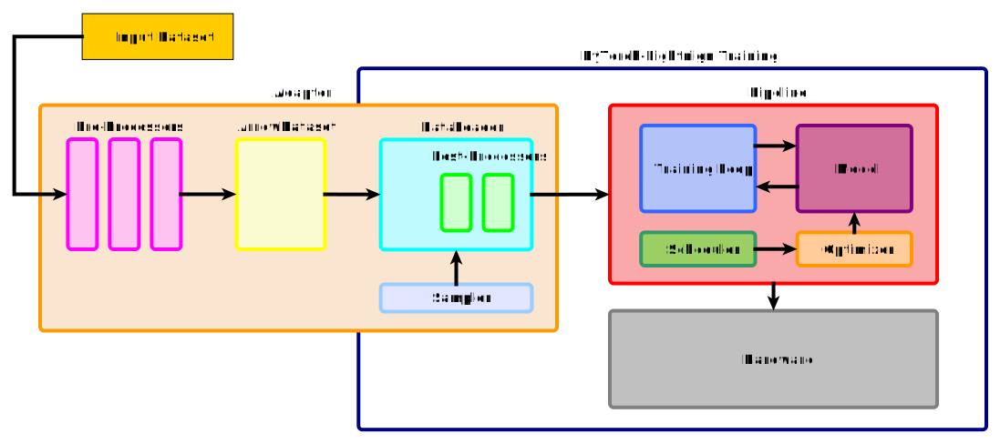

# Transformers-Framework

This framework is studied to easily train different kind of models on pipelines like:
- Masked Language Modeling
- Token Detection
- Answers Selection
- Machine Reading
- Denoising
- Summarization

Moreover, you may train `contextual` models, ELECTRA like models with both a generator and a discriminator and many others various combinations of pipelines.
Since this library is based on `pytorch-lightning`, this framework will automatically work on many device types and many machines. Checkpoints will be saved both for `pytorch-lightning` (to be able to restore training) and for `transformers` (to easily share them).


# High Level structure of this framework




# Prepare env

```bash
make env
```

# Run experiments

Run an experiment with:

```bash
python -m transformers_framework ...
```

# Command line arguments

## Pipeline

The first important argument is `--pipeline`, which selects which pipeline will be used to train the transformer. For example, setting

```bash
--model answer_selection
```

will activate all the arguments to define the fine-tuning of some model for Answer Selection.
After chosing the pipeline, you should choose which transformer architecture to use. For example:

```bash
--model roberta
```

will fine-tune some `RoBERTa` model.

More pipelines examples are available [here](./transformers_framework/pipelines/README.md).


Based on which pipeline and model you selected, many other cli arguments will be available, like

```bash
--pre_trained_model roberta-base
```

Paths can be models on the huggingface hub, local checkpoints or path to S3 folders.

To start training of a model from scratch, pass only the config:

```
--pre_trained_config roberta-base
```

If you provide only a `--pre_trained_model`, then `--pre_trained_config` and `--pre_trained_tokenizer` will be set equal to it.


## General

All the arguments of `pytorch-lightning` trainer are integrated in this framework. So if you want for example to train over 8 GPUs in `fp16` with `deepspeed`, just pass the followings:

```
--devices 8 \
--accelerator gpu \
--strategy deepspeed_stage_2 \
--precision 16 \
```

Is it also very important (and mandatory) to assign a unique name to every run through

```
--name my-first-run-with-transformers-framework
```

Moreover, remember to set the output directory to some disk with low latency because otherwise the script will spend most of the time writing logs and checkpoints. If you cannot, consider increasing the interval between disk writes by setting `--log_every_n_steps` to a large value.

You can set the output directory with:

```
--output_dir /science/lucadiliello/outputs/pretraining
```

After training, the `output_dir` will contain 3 or 4 subdirectories:
- `tensorboard`: the tensorboards of the actual run;
- `pre_trained_models`: folder with all the `transformers` checkpoints, saved with `model.save_pretrained()`;
- `checkpoints`: full training checkpoint in `pytorch-lightning` format with also optimizer and scheduler states to restore training;
- `predictions` (optional): folder with predictions of models on given tasks

Experiments will be differentiated by the name you set before.

Other general arguments comprehend `--accumulate_grad_batches X` for gradient accumulation, `--learning_rate 1e-04`, `--max_steps X` or `--max_epochs` and many others. To change optimizer or scheduler, just set `--optimizer` or `--schduler`.


## Data

In order to use this library, your data should be `jsonlines` files or HF `Dataset` instances, which are the formats loadable with the Huggingface `datasets` library. You can potentially load very large datasets without consuming lot of RAM because the `datasets` library is based on` Apache Arrow`, which uses memory mapping between RAM and disk. If your dataset is in `csv` or `tsv`, you can easily convert it to be a `Dataset` instance with [`load_dataset`](https://huggingface.co/docs/datasets/loading) method. 

The loaded dataset(s) will be subject to two processing steps: one before the training (which allows also to split examples in many others or to do filtering) and one while training (for preparation of examples like tokenization). The first step is called `pre_processing` while the second is called `post_processing`.

`pre_processing` and `post_processing` are defined in each pipeline.

### Datasets

Finally, pass the path to the `Dataset`:

```bash
--train_dataset /path/to/the/train/dataset \
--valid_dataset /path/to/the/validation/dataset \
--test_dataset /path/to/the/test/dataset \
--predict_dataset /path/to/the/prediction/dataset \
```

The paths can be either `Dataset` instances saved to disk with `.save_to_disk(...)` on local disk or on `Amazon s3` and also paths to a dataset on the huggingface repository.

Remember not to pass directly a `DatasetDict`, but pass the subfolder containing the actual dataset. For example:

```bash
--train_dataset lucadiliello/asnq/train \
--valid_dataset lucadiliello/asnq/dev \
--test_dataset lucadiliello/asnq/test \
```

If you skip one of the arguments before, the corresponding step will be skipped. If you want to `test` or `predict` on the best checkpoint found while training, use early stopping over some metric. For example:

```bash
--early_stopping \
--patience 5 \
--monitor valid/answer_selection/mean_average_precision \
--val_check_interval 0.25 \
```

will do 4 validation per each training epoch and check the validation MAP (from the AS2 pipeline). If for `5` times in a row the MAP will not improve, training will be stopped and the best checkpoints (selected with `valid/answer_selection/mean_average_precision`) will be automagically used for testing.


## Work in progress

- Adding the possibility to write configurations to run experiments instead of passing everything from the command line.


## FAQ
- Multi node training: just run the same script on all the machines (just once per machine) and set `MASTER_ADDR`, `MASTER_PORT`, `NODE_RANK` and `WORLD_SIZE` on all machines. For `MASTER_ADDR` and `MASTER_PORT`, just select one of the machines that will behave as master and a free open port (possibly > 1024). Assign `NODE_RANK=0` to the master.


## Examples

### AS2

Train `RoBERTa` on ASNQ and automatically evaluate on the best checkpoint. You can find the dataset here: `s3://research-group-collab/diliello/datasets/asnq_dev_test_dataset/`.

```bash
python -m transformers_framework \
    --pipeline answer_selection \
    --model roberta \
    \
    --precision 16 \
    --accelerator gpu \
    --strategy ddp \
    --devices 8 \
    \
    --pre_trained_model roberta-base \
    --name roberta-base-asnq \
    --output_dir /science/lucadiliello/outputs/pointwise-asnq \
    \
    --batch_size 256 \
    --train_dataset lucadiliello/asnq/train \
    --valid_dataset lucadiliello/asnq/dev \
    --test_dataset lucadiliello/asnq/test \
    --input_columns question answer \
    --label_column label \
    --index_column key \
    \
    --accumulate_grad_batches 1 \
    --max_sequence_length 128 \
    --learning_rate 1e-05 \
    --optimizer adamw \
    --max_epochs 10 \
    --log_every_n_steps 100 \
    --early_stopping \
    --patience 5 \
    --weight_decay 0.0 \
    --num_warmup_steps 10000 \
    --monitor valid/answer_selection/mean_average_precision \
    --val_check_interval 0.5 \
    --num_workers 4
```


### Pretraining

Pretraining `DeBERTa V3` from scratch with both discriminator and generator over raw text from Wikipedia with `DeepSpeed Stage 2`.

```bash
python -m transformers_framework \
    --pipeline token_detection_and_masked_lm \
    --model deberta_v2 \
    \
    --devices 8 \
    --accelerator gpu \
    --strategy deepspeed_stage_2 \
    --precision 16 \
    \
    --pre_trained_generator_config microsoft/deberta-v3-small \
    --pre_trained_config microsoft/deberta-v3-base \
    --pre_trained_tokenizer microsoft/deberta-v3-base \
    --name deberta-v3-base-pretraining \
    --output_dir /science/lucadiliello/outputs/pretraining \
    \
    --batch_size 32 \
    --train_dataset /science/lucadiliello/datasets/enwiki_dataset/train \
    --valid_dataset /science/lucadiliello/datasets/enwiki_dataset/dev \
    --input_columns text_span_1 text_span_2 \
    \
    --accumulate_grad_batches 16 \
    --max_sequence_length 512 \
    --learning_rate 1e-04 \
    --optimizer fuse_adam \
    --max_steps 200000 \
    --weight_decay 0.01 \
    --num_warmup_steps 10000 \
    --val_check_interval 160000 \
    --checkpoint_interval 5000 \
    --num_workers 8
```


### Mac with Apple Silicon

```bash
PYTORCH_ENABLE_MPS_FALLBACK=1 python -m transformers_framework \
    --pipeline answer_selection \
    --model roberta \
    \
    --precision 16 \
    --accelerator mps \
    --devices 1 \
    --pre_trained_model roberta-base \
    --name roberta-base-asnq \
    --output_dir /science/lucadiliello/outputs/pointwise-asnq \
    \
    --batch_size 256 \
    --train_dataset lucadiliello/asnq/train \
    --valid_dataset lucadiliello/asnq/dev \
    --test_dataset lucadiliello/asnq/test \
    --input_columns question answer \
    --label_column label \
    --index_column key \
    \
    --accumulate_grad_batches 1 \
    --max_sequence_length 128 \
    --learning_rate 1e-05 \
    --optimizer adamw \
    --max_epochs 10 \
    --log_every_n_steps 100 \
    --early_stopping \
    --patience 5 \
    --weight_decay 0.0 \
    --num_warmup_steps 10000 \
    --monitor valid/answer_selection/mean_average_precision \
    --val_check_interval 0.5 \
    --num_workers 0  # there are issues with more than 0 workers on Apple Silicon and PyTorch
```

For more examples, look at the scripts in `tests/scripts`.
